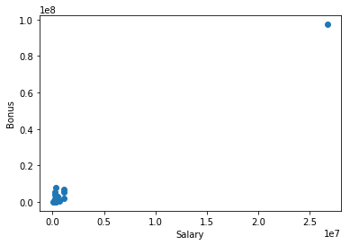
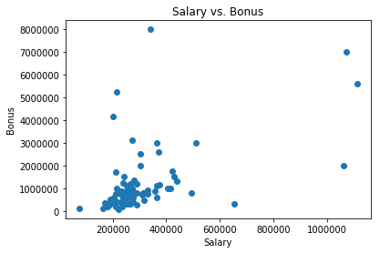
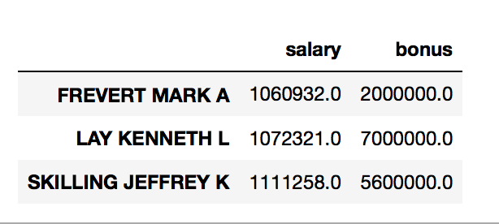
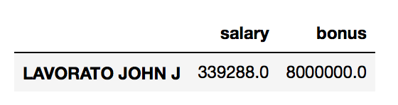
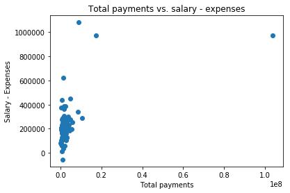
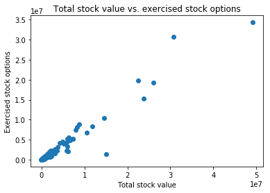

# Identify Enron Fraud Report

## 1. Question 1
Summarize for us the goal of this project and how machine learning is useful in trying to accomplish it. As part of your answer, give some background on the dataset and how it can be used to answer the project question. Were there any outliers in the data when you got it, and how did you handle those?  [relevant rubric items: “data exploration”, “outlier investigation”]

The goal of this project is to take the dataset that contains information on a subset of Enron employees, and predict if they were a person of interest in the fraud.

### 1.1 Total no. of records and features

The dataset has 145 records in total (the 146th record was a "TOTAL" row that also got ingested). There are 21 distinct features. The target variable is "poi". Out of 146 people, there are 18 persons of interests. Thus, there are 128 people who are NOT person of interests. As shared in the Udacity lecture by Kate, this list of 18 persons of interest is not complete. As per the `poi_names.txt` file, there are 35 PoIs in total, but not all of them are present in the dataset.

### 1.2 Odd features

The one odd thing I found were the features 'shared_receipt_with_poi', 'from_this_person_to_poi', and 'from_poi_to_this_person'. I believe they cannot be used as features, because you can know these details only if you already know who the PoIs are. So I'm excluding these features from all of my predictive analyses.

### 1.3 Missing values

The features that have the most amount of missing values are:

1. loan_advances: Only has 4 values out of 146
1. deferred_income: Has 49 values out of 146
1. deferral_payments: Has 39 values out of 146
1. director_fees: Has 17 values out of 146
1. restricted_stock_deferred: Has 18 values out of 146

### 1.4 Candidate features

These are my "candidate features", the ones that I think could be useful in my analysis, considering my initial assumption about their usefulness, and the total no. of values present were. This is not a finalized list, because that will require exhaustive analysis. This is for me to document now so that I can compare it with what the exhaustive search tells me.

1. director_fees
1. restricted_stock_deferred
1. long_term_incentive
1. exercised_stock_options
1. restricted_stock
1. salary
1. bonus
1. expenses

The director_fees is the most interesting, since it has 17 records, and we have 18 PoIs. Although we'd normally be wary of a variable with so many NAs, this one could prove useful.

### 1.5 Outliers

1: There was an entry called "TOTAL", which had the total of all the columns for all the people. This row, thus, was an outlier for all the columns, and had to be removed.



2: There were 3 outliers for salary, namely "FREVERT MARK A", "LAY KENNETH L", and "SKILLING JEFFREY K". These are valid outliers, because they were involved in the fraud, and were holding important positions in the company. These outliers are not like the "TOTAL" one that we found earlier.





3: There was one outlier for bonus, "LAVORATO JOHN J" (as seen from the scatterplot above). Again, these are most likely indicators of PoIs, and not an outlier due to data entry error.



## 2. Question 2
What features did you end up using in your POI identifier, and what selection process did you use to pick them? Did you have to do any scaling? Why or why not? As part of the assignment, you should attempt to engineer your own feature that does not come ready-made in the dataset -- explain what feature you tried to make, and the rationale behind it. (You do not necessarily have to use it in the final analysis, only engineer and test it.) In your feature selection step, if you used an algorithm like a decision tree, please also give the feature importances of the features that you use, and if you used an automated feature selection function like SelectKBest, please report the feature scores and reasons for your choice of parameter values.  [relevant rubric items: “create new features”, “intelligently select features”, “properly scale features”]

### 2.1 Candidate features based on intuition

The following features are derived from PoIs:

1. shared_receipt_with_poi
1. from_this_person_to_poi
1. from_poi_to_this_person

However, to generate these features, you have to know beforehand whether the given person is a PoI. This looks like cheating, and I'm going to discard these features in my analysis. We're trying to predict the PoI field, so we shouldn't derive features from it. (Yes, we're tallying email address as persons of interest, but it still feels that defeating the purpose of machine learning)

I believe the following features could be good starting points to do a computational analysis (SelectKBest, etc.):

1. director_fees
1. restricted_stock_deferred
1. long_term_incentive
1. total_stock_value
1. exercised_stock_options
1. restricted_stock
1. salary
1. bonus
1. expenses
1. total_payments

The reason is, the fraud was all about money. The people who made the most amount of money are highly likely to be persons of interest.

### 2.2 Come up with a new feature

Let's look at the plot below:



I'm considering `salary - expense` to be a new feature. Generally, the higher the salary you draw the greater the expense. But I observed that in a few cases, the salary is disproportionately high compared to the expenses. Maybe this could catch a few PoIs, and I'll also need to only include this one variable `salary - expense` instead of salary and expense individually. (This feature is called "salary_minus_expenses" in the features array of `poi_id.py` file.)

Once I select my final algorithm, I'll test it by including both `salary` and `expense` separately, and then by just having `salary - expenses` instead of having two separate variables.

### 2.3 Candidate features that we might not be able to use

The following features are the ones with a lot of NAs:

1. loan_advances: Only has 4 values out of 146
1. deferred_income: Has 49 values out of 146
1. deferral_payments: Has 39 values out of 146
1. director_fees: Has 17 values out of 146
1. restricted_stock_deferred: Has 18 values out of 146

I'd probably not use most of them, except for director_fees & restricted_stock_deferred, which I think might help in identifying PoIs. There could be other variables from the above list that'd be helpful too, but I'm just picking one for now.

One correlated feature that I came across was `total_stock_value` and `exercised_stock_options`. You can't exercise more stock options than you have, so we see an almost linear relation. Thus, we only need one of the two features, which can reduce training time.



Also, there is one argument against ignoring features that have a lot of missing values. What if, by the virtual of values being missing or not, the target class can be predicted? What if loan_advances were only present for PoIs, and not for others? I agree, it could be. However, I'd still want values for everyone else, even if it's 0. Or else, these missing values could very well represent an external bias or suppositions by the authorities.

### 2.4 Univariate feature selection

I explore the selection of features using SelectKBest. I explored the following features:

1. director_fees
1. restricted_stock_deferred
1. long_term_incentive
1. total_stock_value
1. exercised_stock_options
1. restricted_stock
1. salary
1. bonus
1. expenses
1. total_payments

To do the univariate feature selection, I put SelectKBest in the pipeline for GridSearchCV. This way, I'll know what values of K, and thus, which features are preferred by each of the algorithms, and what kind of performance do they end up giving.

Since the feature selection outcome would be different for different algorithms that I try, I'll defer to "Question 3" to answer which features I used for which algorithms, and why.

### 2.5 Feature scaling

I did not have to do any feature scaling.

## Question 3
What algorithm did you end up using? What other one(s) did you try? How did model performance differ between algorithms?

I initally played around with SVC and DecisionTree in my jupyter notebook. However, after the train test split, SVC was just taking too long for the GridSearch, so I abondoned it.

I tried RandomForestClassifier, DecisionTreeClassifier, and GaussianNB. I modified the code in `poi_id.py` file so that I could select the best features for each of the algorithms, and then find the test results for the best parameters per classifier.

There were two distinct cases. In one case, I put "salary" and "expenses" as candidate features. In the second case, I removed "salary" and "expenses" from features_list, and instead put in my "salary_minus_expenses" feature, to test how it impacts performance across different algorithms.

**CASE 1: Using "expenses" and "salary" in the features list**

```
Classifier:  dt (Decision Tree)
Best params:  {'clf__min_samples_leaf': 1, 'clf__min_samples_split': 6, 'skb__k': 4}
Best score:  0.89
Best features:  ['exercised_stock_options', 'restricted_stock', 'bonus', 'salary']
Final features list:  ['poi', 'exercised_stock_options', 'restricted_stock', 'bonus', 'salary']
DecisionTreeClassifier(class_weight=None, criterion='gini', max_depth=None,
            max_features=None, max_leaf_nodes=None,
            min_impurity_decrease=0.0, min_impurity_split=None,
            min_samples_leaf=1, min_samples_split=6,
            min_weight_fraction_leaf=0.0, presort=False, random_state=0,
            splitter='best')
    Accuracy: 0.79686   Precision: 0.27040  Recall: 0.24850 F1: 0.25899 F2: 0.25259
    Total predictions: 14000    True positives:  497    False positives: 1341   False negatives: 1503   True negatives: 10659

Classifier:  nb (Gaussian Naive Bayes)
Best params:  {'skb__k': 1}
Best score:  0.88
Best features:  ['exercised_stock_options']
Final features list:  ['poi', 'exercised_stock_options']
GaussianNB(priors=None)
    Accuracy: 0.90409   Precision: 0.46055  Recall: 0.32100 F1: 0.37831 F2: 0.34171
    Total predictions: 11000    True positives:  321    False positives:  376   False negatives:  679   True negatives: 9624

Classifier:  rf (Random Forest)
Best params:  {'skb__k': 2, 'clf__min_samples_leaf': 2, 'clf__min_samples_split': 10, 'clf__n_estimators': 15}
Best score:  0.9
Best features:  ['exercised_stock_options', 'salary']
Final features list:  ['poi', 'exercised_stock_options', 'salary']
RandomForestClassifier(bootstrap=True, class_weight=None, criterion='gini',
            max_depth=None, max_features='auto', max_leaf_nodes=None,
            min_impurity_decrease=0.0, min_impurity_split=None,
            min_samples_leaf=2, min_samples_split=10,
            min_weight_fraction_leaf=0.0, n_estimators=15, n_jobs=1,
            oob_score=False, random_state=0, verbose=0, warm_start=False)
    Accuracy: 0.84469   Precision: 0.48738  Recall: 0.18350 F1: 0.26662 F2: 0.20964
    Total predictions: 13000    True positives:  367    False positives:  386   False negatives: 1633   True negatives: 10614
```

In this case, I got satisfactory results only with the GaussinNB, since it was the only one that passes the rubric.

**CASE 2: Using "expenses_minus_salary" instead of "expenses" and "salary" separately**

Inside `poi_id.py` file, I included a boolean flag called `use_salary_minus_expenses`, to make this switch easy.

```
Classifier:  dt (Decision Tree)
Best params:  {'clf__min_samples_leaf': 2, 'clf__min_samples_split': 10, 'skb__k': 4}
Best score:  0.9
Best features:  ['exercised_stock_options', 'restricted_stock', 'bonus', 'salary_minus_expenses']
Final features list:  ['poi', 'exercised_stock_options', 'restricted_stock', 'bonus', 'salary_minus_expenses']
DecisionTreeClassifier(class_weight=None, criterion='gini', max_depth=None,
            max_features=None, max_leaf_nodes=None,
            min_impurity_decrease=0.0, min_impurity_split=None,
            min_samples_leaf=2, min_samples_split=10,
            min_weight_fraction_leaf=0.0, presort=False, random_state=0,
            splitter='best')
    Accuracy: 0.81277   Precision: 0.34718  Recall: 0.24650 F1: 0.28830 F2: 0.26168
    Total predictions: 13000    True positives:  493    False positives:  927   False negatives: 1507   True negatives: 10073

Classifier:  nb (Gaussian Naive Bayes)
Best params:  {'skb__k': 1}
Best score:  0.88
Best features:  ['exercised_stock_options']
Final features list:  ['poi', 'exercised_stock_options']
GaussianNB(priors=None)
    Accuracy: 0.90409   Precision: 0.46055  Recall: 0.32100 F1: 0.37831 F2: 0.34171
    Total predictions: 11000    True positives:  321    False positives:  376   False negatives:  679   True negatives: 9624

Classifier:  rf (Random Forest)
Best params:  {'skb__k': 2, 'clf__min_samples_leaf': 2, 'clf__min_samples_split': 10, 'clf__n_estimators': 15}
Best score:  0.91
Best features:  ['exercised_stock_options', 'salary_minus_expenses']
Final features list:  ['poi', 'exercised_stock_options', 'salary_minus_expenses']
RandomForestClassifier(bootstrap=True, class_weight=None, criterion='gini',
            max_depth=None, max_features='auto', max_leaf_nodes=None,
            min_impurity_decrease=0.0, min_impurity_split=None,
            min_samples_leaf=2, min_samples_split=10,
            min_weight_fraction_leaf=0.0, n_estimators=15, n_jobs=1,
            oob_score=False, random_state=0, verbose=0, warm_start=False)
    Accuracy: 0.83467   Precision: 0.51227  Recall: 0.16700 F1: 0.25189 F2: 0.19302
    Total predictions: 12000    True positives:  334    False positives:  318   False negatives: 1666   True negatives: 9682
```

When I added "salary_minus_expenses" and removed "salary" and "expenses" from the candidate feature pool, it resulted no difference in performance for the Gaussian Naive Bayes. Even in the first case SelectKBest did not choose either of salary or expenses to predict PoIs, and it did not select salary_minus_expenses.

1. *GaussianNB with salary and expenses:* Accuracy: 0.90409   Precision: 0.46055  Recall: 0.32100 F1: 0.37831 F2: 0.34171
1. *GaussianNB with salary_minus_expenses:*  Accuracy: 0.90409   Precision: 0.46055  Recall: 0.32100 F1: 0.37831 F2: 0.34171

Thus, I ended up using the GaussianNB classifier with the following features (well, just one):

1. exercised_stock_options

## Question 4
What does it mean to tune the parameters of an algorithm, and what can happen if you don’t do this well?  How did you tune the parameters of your particular algorithm? What parameters did you tune? (Some algorithms do not have parameters that you need to tune -- if this is the case for the one you picked, identify and briefly explain how you would have done it for the model that was not your final choice or a different model that does utilize parameter tuning, e.g. a decision tree classifier).  [relevant rubric items: “discuss parameter tuning”, “tune the algorithm”]

Hyperparameters are parameters of an estimator that are not learnt during training. This has to be specified by us before the training of the data. Algorithms are parameterized so that we can adapt them to different types of data. A wrong set of parameters can mean that the algorithm won't learn from the data well. I used GridSearchCV to find the right set of parameters for each of the algorithms that gave the best accuracy. This is a "search" approach for finding the right paramters.

Internally, for every combination of parameters that we provide to the GridSearch algorithm, it trains the training set and validates it using KFold cross valdiation. I also made sure that it stratified the split, since we had very little positive labels.

Hyperparameters are tuned to the training data, and might not always generalize to the test set. So there is a way that we might overfit the classifier by overdoing the hyperparameter tuning.

## Question 5
What is validation, and what’s a classic mistake you can make if you do it wrong? How did you validate your analysis?  [relevant rubric items: “discuss validation”, “validation strategy”]

If we train a classifier, and only look at the training performance, then we won't know if the classifier has really learnt the data or has just memorized the training set.

We should always measure the performance of the classifier on data that it has not seen before, so that we get an idea of how the classifier generalizes.

We thus divide the training data into a "training set" and a "validation set". The validation set is the set that the classifier does NOT get to train on. Once trained on the training set, we check the performance of the classifier on the validation set. If the classifier performed well on the training set, but not well on the validation set, then we know that the classifier is overfitting.

Validation helps us avoid overfitting. I used GridSearchCV for K-fold cross validation. However, since I went ahead with GaussianNB, which didn't need the GridSearchCV, performance was measured on the "test" set. Test set consisted of 30% of the data that the classifier did not train on, so that we could measure its performance on unseen data.

## Question 6
Give at least 2 evaluation metrics and your average performance for each of them.  Explain an interpretation of your metrics that says something human-understandable about your algorithm’s performance. [relevant rubric item: “usage of evaluation metrics”]

The two metrics that I tracked were precision and recall. The final algorithm achieved a precision of 0.46055 and a recall of 0.32100.

Precision means, out of all the people we classified as persons of interest, how many were actually persons of interest. If we falsely flagged someone as a person of interest, then the precision reduces.

Recall means, out of all the people who are really persons of interest, how many could be identify as persons of interest. Could we "recall" that these people are persons of interest. If we fail to identify a person as a PoI, then recall of the classifier reduces.

